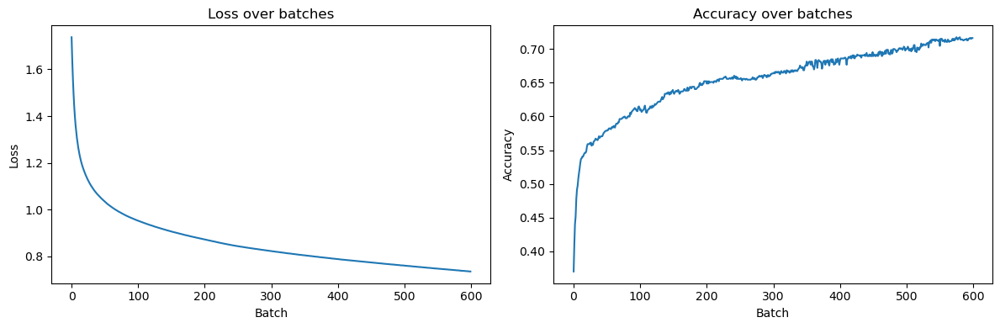

# Machine Learning algorithms from scratch

This repository implements several machine learning algorithms from scratch, without relying on machine learning frameworks.
The goal of this project is mainly educational: to understand the mathematical foundations and internal mechanisms of ML algorithms rather than optimizing performance.

I use only a few libraries to handle datasets (pandas) and perform efficient mathematical operations (NumPy).
Currently, the project includes a linear regression model and a neural network to predict wine quality based on several features.
## 1 Linear Regression

### 1.1 Mathematical Foundations

#### Data Normalization

Normalizing the data means scaling all features between 0 and 1 to reduce the impact of very large values and improve predictions.

- **Standardization (z-score)**
  $$(x'=\dfrac{x-\mu}{\sigma}); \space with \space\mu=\dfrac{1}{n}\sum_{i=1}^n x_i\space and \space\sigma=\sqrt{\dfrac{1}{n}\sum_{i=1}^n (x_i-\mu)^2}$$
  
#### Finding the Optimal Parameters

Given the number of features in our dataset (11 here), we do not use an iterative optimization algorithm such as gradient descent.
Instead, we apply the Ordinary Least Squares (OLS) estimator in its closed-form matrix expression to directly compute the optimal parameters.
This approach finds the best parameters immediately, but can be computationally expensive due to the matrix inversion step (up to $\mathcal{O}(p^3)$ depending on the algorithm used).

We model $(y=X\beta+\varepsilon)$, with $(X\in\mathbb{R}^{n\times p}$) including a column of ones for the intercept.

OLS estimator in matrix form:
$$\hat{\beta}=(X^\top X)^{-1}X^\top y$$

This formula returns the parameter vector used for prediction.
#### Evaluating Predictions

To measure how well the model fits the data, we use two metrics:

- $R^2$: the proportion of variance in the target explained by the model compared to a constant prediction (the mean).

$$ R^2=1-\frac{\sum_{1}^{n}(y_i-\hat{y}_i)^2}{\sum_{1}^{n}(y_i-\bar{y}_i)^2}$$

- $RMSE$ (Root Mean Square Error): measures the average difference between predictions and true values. Lower is better.

$$RMSE=\sqrt{\frac{\sum_{1}^{n}(y_i-\hat{y}_i)^2}{n}}$$

Where:
- $y_i$ is the true value
- $\hat{y}_i$ is the predicted value
- $n$ is the dataset size


## 2 Neural Network

### 2.1 Preprocessing

**Feature scaling**  
Standardization fitted on training set, applied to both train/test:
 $$x'=\frac{x-\mu_{\text{train}}}{\sigma_{\text{train}}}$$

**Target encoding**  
Classification task. Labels are integers $(0,\dots,K-1)$. A one-hot encoding is applied internally. In our case, ratings range from 3 to 8. The algorithm maps $y=y-3$ to obtain $K=6$ classes instead of 11 (0–10), since not all labels are used.

### 2.2 Architecture

- Input : 11 features.  
- Fully connected layers: $11\to64\to32\to16\to K$
- Activations: ReLU in hidden layers, Softmax in output layer
- Initialization: random weights, zero biases

#### ReLU Activation

##### Definition
Element-wise operation:
$$
\operatorname{ReLU}(z)=\max(0,z)
$$
##### Forward propagation (layer $l$):
$$
Z^{(l)}=A^{(l-1)}W^{(l)}+b^{(l)},\qquad
A^{(l)}=\mathrm{ReLU}\!\big(Z^{(l)}\big)\
$$

#### Softmax Activation

##### Definition
For a vector of logits $z\in\mathbb{R}^K$:
$$
\operatorname{softmax}(z)_k=\frac{e^{z_k}}{\sum_{j=1}^{K} e^{z_j}},\quad k=1,\dots,K
$$
Properties: $\hat y_k\in(0,1)$ and $\sum_k \hat y_k=1$.


### 2.3 Loss

#### Categorical Cross Entropy
$$
\mathcal{L}=-\frac{1}{n}\sum_{i=1}^{n}\log\big(\hat{y}_{i,\,y_i}\big)
$$

### 2.4 Backpropagation

Softmax + Cross-Entropy coupling:
$$
\frac{\partial \mathcal{L}}{\partial Z^{(L)}}=\frac{\hat{Y}-Y}{n}
$$

For each dense layer $l$
$$
\begin{aligned}
\frac{\partial \mathcal{L}}{\partial W^{(l)}}&=(A^{(l-1)})^\top\,\delta^{(l)}\\
\frac{\partial \mathcal{L}}{\partial b^{(l)}}&=\sum_{i=1}^{n}\delta^{(l)}_{i}\\
\delta^{(l-1)}&=\delta^{(l)}(W^{(l)})^\top
\end{aligned}
$$

ReLU derivative:
$$
\frac{\partial \mathcal{L}}{\partial Z^{(l)}}=\frac{\partial \mathcal{L}}{\partial A^{(l)}}\odot \mathbf{1}_{Z^{(l)}>0}
$$

### 2.5 Optimization

Gradient descent (full batch or mini-batch):
$$
W^{(l)}\leftarrow W^{(l)}-\eta\,\frac{\partial \mathcal{L}}{\partial W^{(l)}},\qquad
b^{(l)}\leftarrow b^{(l)}-\eta\,\frac{\partial \mathcal{L}}{\partial b^{(l)}}
$$

Typical hyperparameters: $\eta=10^{-3}$ to $10^{-2}$, $100–1000$ epochs, batch size $32–256$.

### 2.6 Evaluation

#### Accuracy :
$$
\mathrm{Acc}=\frac{1}{n}\sum_{i=1}^{n}\mathbf{1}\{\arg\max\hat{y}_{i,k}=y_i\}
$$

#### Loss Function

For a batch of $n$ examples with true class $y_i$ and predicted probabilities $\hat y_{i,k}$:
$$
L = -\frac{1}{n}\sum_{i = 1}^{n}\log\big(\hat y_{i,y_i}\big)
$$


### 2.7 Reproducibility

The shuffle is fixed using a random seed. The train/test split is deterministic as well. Epochs and learning rate are configurable in the main function. Running the notebook will always yield the same results.

### 3 Installation

To run the notebooks, you will need NumPy, Pandas, and Matplotlib.
You can either use an existing environment that includes them, or create a new one as follows:

#### With conda 

```
conda create -n env_name numpy pandas matplotlib
```

#### With pip

```
python -m venv env
source env/bin/activate   # Linux/Mac
env\Scripts\activate      # Windows
pip install numpy pandas matplotlib
```

### 4 Results

#### Linear Regression

Evaluation metrics on my random seed and split:
- $R^2=0.24$
- $RMSE=0.66$

#### Neural Network

Metrics used: Accuracy and Loss. Results obtained:
- $Accuracy=0.5524$
- $Loss = 1.1366$

Evolution of scores during training:



| Model             | Metrics                          |
| ----------------- | -------------------------------- |
| Linear Regression | R² = 0.24, RMSE = 0.66           |
| Neural Network    | Accuracy = 0.5524, Loss = 1.1366 |


### 5 Limitations and Improvements

To improve the neural network, I could add L2 regularization or dropout to prevent overfitting (though current loss and accuracy do not suggest severe overfitting).
I could also implement early stopping to avoid running unnecessary epochs once the loss stops decreasing significantly.